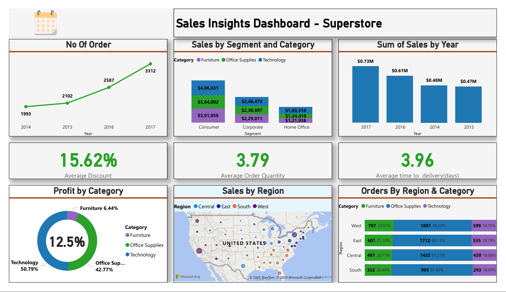

# 📊 Superstore Sales Insights Dashboard

## 📋 Project Overview
This project is part of the Data Analyst Internship (Task 2: Data Visualization and Storytelling).

Objective:  
Create a clean, insightful Power BI dashboard using the Superstore dataset, focusing on sales performance, regional distribution, and profit trends from 2014–2017.

---

## 🛠 Tools Used
- Power BI Desktop
- Excel
- PowerPoint

---

## 🎯 Key Business Insights
- 📈 Number of Orders steadily increased from 1993 (2014) to 3312 (2017).
- 💰 Technology category contributed the highest profit (50.79%).
- 🗺️ West region recorded the highest number of orders.
- 📦 Average delivery time is 3.96 days.
- 🎯 Highest sales generated in 2017 ($0.73M).

---

## 📂 Files Included
- `SuperStore.pbix` → Power BI working file.
- - `Superstore.csv` → Raw Data.
- `Superstore.pdf` → Exported Dashboard in PDF.
- `Superstore.png` → Dashboard Screenshot.
- `Superstore.pptx` → Project Documentation.
- `Superstore Documentation.pfd` → Exported Project Documentation in PDF.

---

## 📷 Dashboard Preview

---

## 🔗 Live Dashboard Link
> 🚀 **Live Power BI Dashboard:**  
> [Click Here to View](https://app.powerbi.com/view?r=eyJrIjoiMGIxZDZhMTktZjExYi00OGRjLWJjYjktMWQ3MWE4NDY4NTQyIiwidCI6IjUwMTcxNjkxLTExNDItNDFjMi1hNzZjLWM2MDljZDExMmYzZiJ9)  

---

## 🛠 Steps Followed
1. Selected appropriate chart types (Line Chart, Stacked Column, Donut, Map).
2. Used clean and consistent color palette (Blue, Green, Purple shades).
3. Highlighted key business insights clearly.
4. Added context for each visual for better understanding.
5. Focused on storytelling, not just raw visuals.
6. Created a storyboard summary in a separate presentation (PPT).

---

## 🚀 Conclusion
- Designed a clean and effective dashboard using Power BI.
- Focused on storytelling with clear insights, minimal clutter, and professional visuals.
- Developed strong data storytelling skills through real-world business sales data.

---

# 🌟 Thank You!

